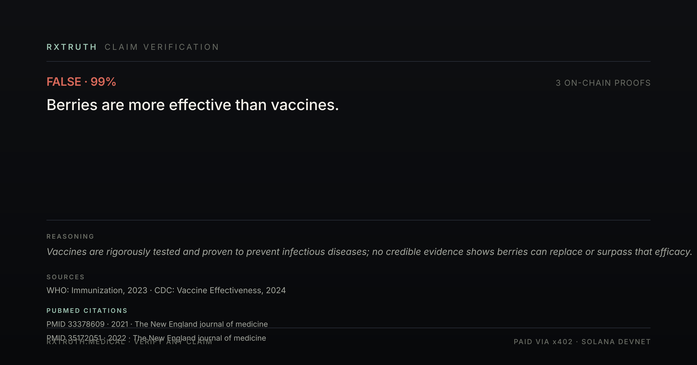
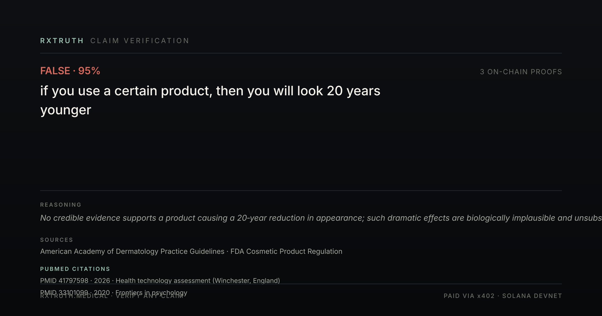
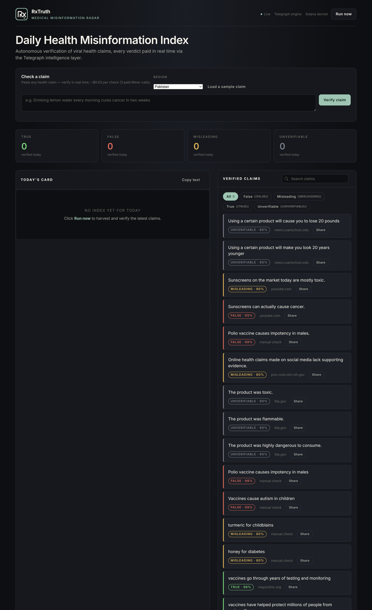

# RxTruth

> **Medical Misinformation Radar · Telegraph Hackathon 2026 · Track 3**

---

## What is RxTruth?

A small app that finds viral health claims online, asks four different AI services whether each
claim is true, false, or in between, and writes a daily **Health Misinformation Index** so
journalists, doctors, and ordinary people can see what is circulating and whether it is real.

Once it is running, it wakes up every six hours on its own: it searches the news, extracts
new claims, verifies each one, and rebuilds the index. You do not need to press anything
**while the server is running.** (If you stop the server, the schedule pauses — it is not a
cloud host. For a 24/7 deployment you would host it on a small always-on machine.)

---

## Why does this exist?

In Pakistan (and in many countries), health misinformation spreads on WhatsApp, X, and Facebook
faster than the truth. People forward warnings about "miracle cures" that are not real, and by
the time a doctor sees the message it has reached a million people.

RxTruth was built to make the act of fact-checking a viral health claim as cheap and fast as
forwarding it. The system watches live news, extracts the medical claims, runs each claim
through several independent AI services, and publishes a verdict card that can be shared
in the same WhatsApp group the misinformation arrived in.

---

## How does it work?

A viral claim goes through four steps. Each step costs about $0.01 in test-network money.

```
1. News search       2. Extract claim     3. Medical check      4. Spam check
   (Tavily)            (Groq LLM)           (Groq LLM +             (ItsAI)
                                           Community Memory)
                                              |
                                              v
                                       SQLite database
                                              |
                                              v
                                      Daily Index card
                                      (SVG, 1200x630)
                                              |
                                              v
                                    Shared on X (optional)
```

1. **Search the news** for new viral health stories. Done by an AI service called Tavily.
2. **Pull the medical claim out** of each story. Done by a large language model (Groq).
3. **Verify the claim** against two independent services: the same Groq model (acting as a
   doctor) and a community-knowledge service (Community Memory). The two verdicts are
   compared.
4. **Check whether the claim text was probably written by a human or by another AI**. This
   catches AI-generated health spam before it spreads.

Every single call to an AI service is paid in real time, and the payment produces a
**transaction hash on the Solana blockchain**. That hash is stored next to the verdict. Anyone
can look up the hash on a block explorer and confirm the inference was real, not faked.

---

## Is the data real?

Yes. You can verify it yourself right now.

- **Public wallet** that pays the AI services: `2D5j28LFrEJUScrZzgbPV5ByTEJhZuXfyrX8ioC2QMQo`
  (Solana devnet)
- **Transaction hashes** for every verdict are stored in the local database
  (`data/rxtruth.db`) and shown in the dashboard
- **The current tally** at the time of writing: 23 claims verified, roughly half with three
  on-chain proofs each (the four AI services that were reachable)

The whole point of using a blockchain-based payment is to make the audit trail
cryptographically verifiable. It is harder to fake this than to fake a chart.

---

## How do I run it locally?

You need Node.js 20 or newer and about 5 minutes.

```bash
git clone https://github.com/COSMICnoob80/rxtruth
cd rxtruth
npm install
npm run dev
```

The dashboard will appear at `http://localhost:3001`. There is an input box where you can paste
any health claim and press "Verify claim" to see a live verdict in about 3 to 12 seconds.

To run the full autonomous harvest cycle (it reads real news and verifies every claim it
finds), click "Run now" on the dashboard, or:

```bash
npm run run:once
```

To fund the wallet that pays the AI services (free test-network money):

1. Get 2 SOL from the devnet faucet: `solana airdrop 2` (or the faucet in your wallet app)
2. Get 20 USDC from <https://faucet.circle.com> — choose "USDC" and "Solana Devnet"

That gives you roughly 2,000 paid AI calls, which is more than enough for a multi-day demo.

---

## What does the day-to-day look like?

Every six hours, automatically:

1. RxTruth searches the news for viral health claims.
2. It extracts each claim and verifies it through four AI services.
3. The verdicts are saved to a local database.
4. A daily "Health Misinformation Index" card is generated as an image (SVG).
5. If X (Twitter) API keys are configured, the card is posted to X with a short caption.
   Otherwise the card is saved as a file and can be posted manually.

You can also paste any health claim into the dashboard and verify it on demand, without
waiting for the cron.

---

## Who built this

One doctor. No co-founders, no engineers hired.

RxTruth was vibe-coded with an AI pair programmer over about a week. The AI does the heavy lifting —
blockchain stack, miner routing, dashboard, and pulling real PubMed citations for every verdict. The
doctor oversees the medical side: making sure the claims being checked actually matter to public health
and that the verdicts don't miss the obvious stuff a layperson would.

AI does the work. A doctor keeps it honest. That's the team.

---

## What's in the repo?

| File or folder | What it does |
|---|---|
| `src/server.ts` | The web server and the dashboard HTML |
| `src/pipeline.ts` | The harvest, extract, verify, and persist cycle |
| `src/clients/` | One file per AI service we call (Tavily, Groq, Community Memory, ItsAI) |
| `src/cards.ts` | The daily Index card image generator |
| `src/xPoster.ts` | The 280-character X post composer |
| `src/store.ts` | The local SQLite database (where claims and verdicts are saved) |
| `src/payments/x402.ts` | The Solana payment wrapper for AI calls |
| `data/cards/` | Every daily Index card we have ever generated |
| `data/rxtruth.db` | The local claims database |
| `assets/brand/` | The logo and social-media share images |

---

## What does a debunk card look like?

Every verified claim gets a shareable card with the verdict, reasoning, real PubMed
citations, and on-chain transaction proofs. Here are two live examples generated from
actual data in this repo:

**FALSE · 99% — "Berries are more effective than vaccines"**


**FALSE · 95% — "If you use a certain product, then you will look 20 years younger"**


The PubMed IDs resolve on [pubmed.ncbi.nlm.nih.gov](https://pubmed.ncbi.nlm.nih.gov) and the
tx hashes resolve on [Solana Explorer](https://explorer.solana.com) (devnet). These are not
mockups — they are generated live from the database.

---

## How does the dashboard look?



The dashboard is the live product at `GET /`. Paste any health claim, pick a region for
sample claims, and watch three AI services respond in real time. Click **Run now** to
trigger the full autonomous harvest cycle.

---

## API

| Endpoint | Description |
|---|---|
| `GET /` | The dashboard (HTML) |
| `GET /api/health` | Liveness check |
| `GET /api/claims?hours=24` | JSON of all claims verified in the last 24 hours |
| `GET /api/index/today` | Today's Index + the SVG card |
| `POST /api/claims/verify` | Verify a single claim on demand (body: `{claim: "..."}`) |
| `POST /api/run` | Trigger the full harvest cycle (header: `x-run-token`) |

---

## License

MIT
